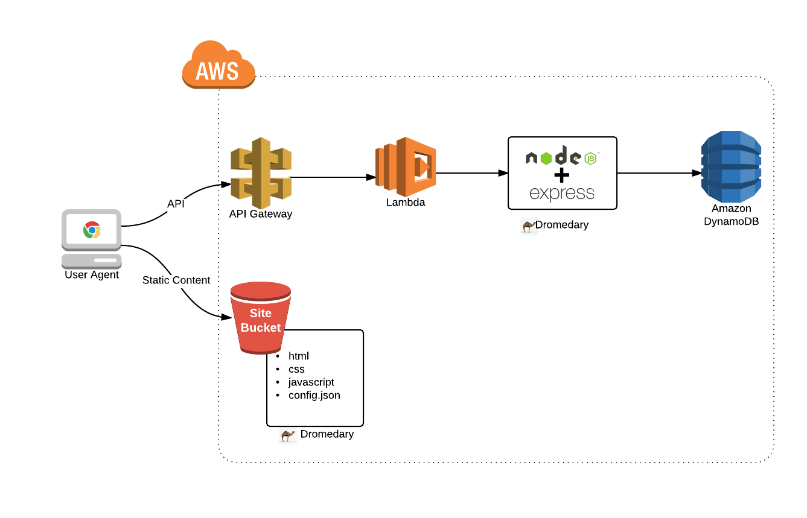
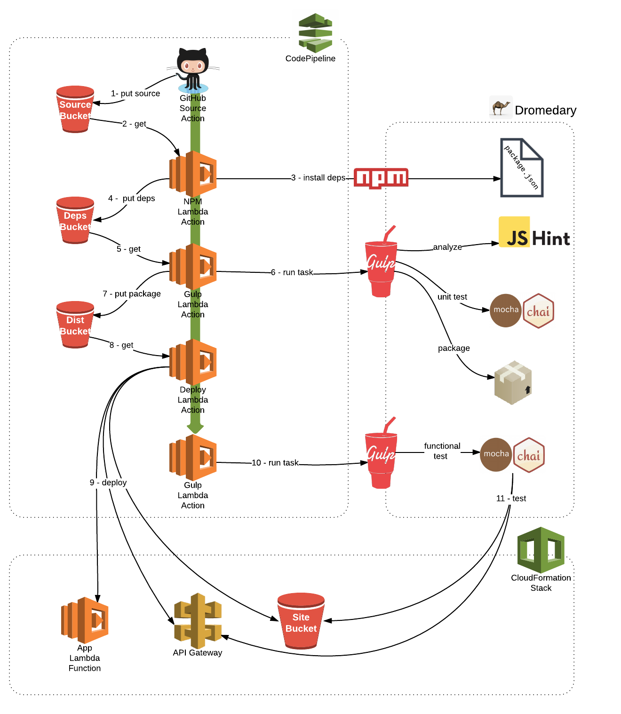

# Overview
This project deploys [dromedary](https://github.com/stelligent/dromedary) in AWS Lambda with API Gateway as the interface to demonstrate serverless architecture.  It also demonstrates the use of CodePipeline with Lambdas to continuously deliver changes made in the source code in a serverless manner.

# Architecture Overview
The application is split into 2 separate parts for deployment:

* **API** - deployed as a Lambda function using API Gateway for the front end.
* **Static Content** - deployed into an S3 bucket with website hosting enabled.

Additionally, a `config.json` file is generated and deployed into the S3 bucket containing the endpoint to use for the API in the API Gateway.

# Pipeline Overview
The pipeline consists of the following steps:

* **commit** - a commit in GitHub triggers a new CodePipeline job. The source is downloaded from GitHub and then pushed into an S3 bucket as a zip file.
* **npm lambda** - a lambda is executed that downloads the source zip file, runs `npm install` to get he dependencies and then uploads the source+dependencies to S3 as a tarball.
* **gulp lambda(s)** - a lambda is executed that downloads the source+dependencies tarball from S3, extracts it, then runs a gulp task

The details of what happens in the gulp task is completely owned by the `gulpfile.js` in the source code.  This provides decoupling of the pipeline from the app and allows the pipeline template to be used by any gulp project.

Here's a sample of what the pipeline looks like in AWS CodePipeline console:

# Launching App

You can launch via the console: 

Or you can launch by using `gulp` in this repo:

* **PREREQUISITES -** You need Node.js installed.  If using a linux machine, you can run `sudo yum install nodejs npm --enablerepo=epel`, or for OS X, check out [nodejs.org](https://nodejs.org/en/download/).  You'll also want to have gulp installed: `npm install -g gulp`
* Download this repo and then run `npm install` first to install all dependent modules.
* To provision the AWS resources and deploy the app, just run `gulp app:launch`
* You can run `gulp app:wait` to wait for the stack to come up, and then `gulp app:status` to get the outputs, including the application URL.
* To tear everything down, run `gulp app:teardown`
* By default, the stack name will be **dromedary-serverless**.  You can change this by passing `--stackName=my-stack-name` to any of the above gulp commands.

# Launching Pipeline

To integrate with GitHub, AWS CodePipeline uses OAuth tokens.  Generate your token at [GitHub](https://github.com/settings/tokens) and ensure you enable the following two scopes:
* `admin:repo_hook`, which is used to detect when you have committed and pushed changes to the repository
* `repo`, which is used to read and pull artifacts from public and private repositories into a pipeline

You can launch via the console: 

Or you can launch by using `gulp` in this repo:

* **PREREQUISITES -** You need Node.js installed.  If using a linux machine, you can run `sudo yum install nodejs npm --enablerepo=epel`, or for OS X, check out [nodejs.org](https://nodejs.org/en/download/).  You'll also want to have gulp installed: `npm install -g gulp`
* Download this repo and then run `npm install` first to install all dependent modules.
* Bring the pipeline up with `gulp pipeline:up --token=XXXXXXXXXXXXXXXXX`
* You can run `gulp pipeline:wait` to wait for the stack to come up, and then `gulp pipeline:status` to get the outputs and `gulp pipeline:stacks` to see what applicaiton stacks the pipeline has currently running.
* To tear everything down, run `gulp pipeline:teardown`
* By default, the stack name will be **dromedary-serverless-pipeline**.  You can change this by passing `--stackName=my-stack-name` to any of the above gulp commands.

# Todo
* Tighten up IAM policies in CFN
* Production deployment in pipeline
* Extract out `/app` directory to generic module named `gulp-serverless-app` to enable running Express Node.js apps in AWS with Lambda and API Gateway.
* Extract out `/pipeline` directory to generic module named `gulp-serverless-pipeline` to enable running CodePipeline with Gulp for other applications.
